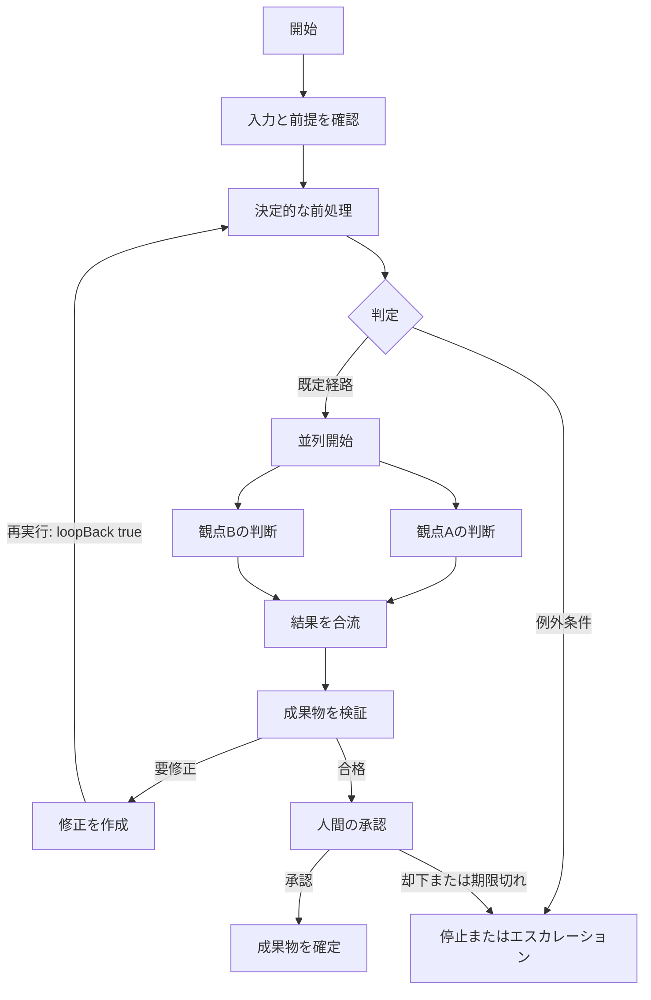
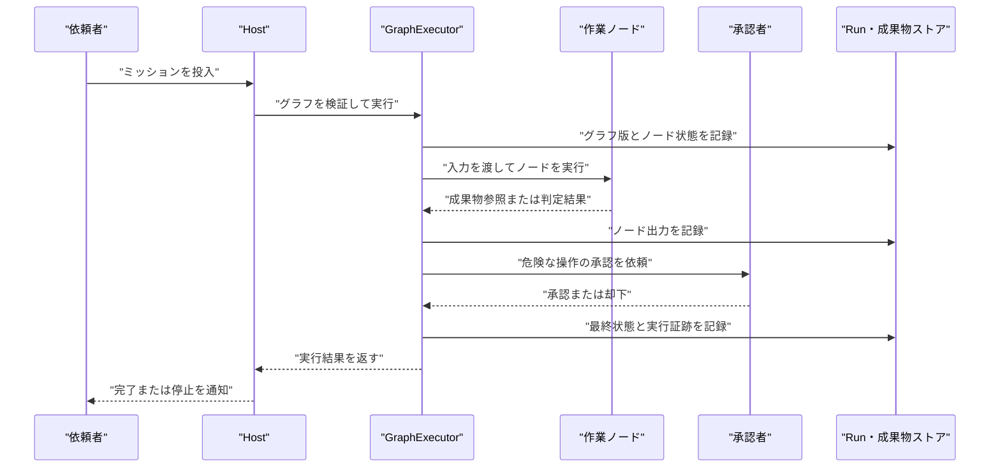

# グラフ設計書: <graph-name>

この文書は `graph.yaml` の前に作成する設計書のテンプレートです。
グラフの処理内容が決まっていない段階で YAML を書き始めず、まずこの文書の目的、入出力、責務、経路、停止条件を埋めてください。

設計書を保存する場合の例: `docs/graphs/<graph-name>-design.md`

## 0. 文書情報

| 項目 | 内容 |
|---|---|
| グラフ名 | `<graph-name>` |
| 表示名 | `<display name>` |
| スキーマバージョン | `1` |
| 対応するフォルダー | `src/WorkAgents.Agents/graphs/<graph-name>/` |
| 対応する定義 | `graph.yaml` |
| 作成者 | `<name>` |
| 作成日 | `<YYYY-MM-DD>` |
| 最終更新日 | `<YYYY-MM-DD>` |
| ステータス | `draft / review / approved / implemented` |
| 関連チケット・ADR | `<link or none>` |

## 1. 目的と範囲

### 1.1 解決する業務上の問題

`[TODO] いま何を人手で行っていて、何が遅い・不安定・説明困難なのかを書く。`

### 1.2 グラフの目的

`[TODO] このグラフを実行した結果、何を達成するのかを一文で書く。`

### 1.3 成功条件

| ID | 成功条件 | 判定方法 | 判定するノード |
|---|---|---|---|
| SC-001 | `<例: 成果物が検証済み状態になる>` | `<例: code ノードの status が passed>` | `<node-id>` |
| SC-002 | `<...>` | `<...>` | `<node-id>` |

### 1.4 対象範囲と対象外

| 区分 | 内容 |
|---|---|
| 対象 | `<このグラフが責任を持つ範囲>` |
| 対象外 | `<別のグラフ、人間の手作業、将来対応など>` |
| 前提 | `<利用可能な agent、team、workspace、外部サービス>` |

## 2. 実行契約

### 2.1 開始条件

| 項目 | 内容 |
|---|---|
| 起動方法 | `mission / trigger / subgraph` |
| target kind | `Graph` |
| target name | `<graph-name>` |
| 開始条件 | `<どの状態で起動できるか>` |
| 二重起動の扱い | `<許可 / 拒否 / 同一 mission に統合>` |

### 2.2 入力

機密値そのものは記載せず、秘密の名前や参照方法だけを記載します。

| 入力名 | 参照元 | 必須 | 型・形式 | 例 | 機密性 |
|---|---|---:|---|---|---|
| `mission.goal` | ミッション | yes | string | `<依頼文>` | 通常 |
| `mission.id` | ミッション | yes | string | `<run identifier>` | 通常 |
| `<input-name>` | `<source>` | `<yes/no>` | `<type/schema>` | `<safe example>` | `<通常/機密>` |

### 2.3 出力

| 出力名 | 生成ノード | 型・形式 | 利用者 | 成功値 | 失敗値 |
|---|---|---|---|---|---|
| `<output-name>` | `<node-id>` | `<string/object/artifact-ref>` | `<consumer>` | `<...>` | `<...>` |

### 2.4 前提条件と事後条件

#### 前提条件

- `[TODO] 参照する agent、team、graph が存在する`
- `[TODO] workspace / artifacts の準備条件`
- `[TODO] 外部サービスや入力ファイルの準備条件`

#### 事後条件

- `[TODO] 成果物の保存場所と状態`
- `[TODO] Run と node の最終状態`
- `[TODO] 後続処理へ渡せる参照`

## 3. 設計方針

### 3.1 ノードの分類

| 分類 | 採用するノード | このグラフでの方針 |
|---|---|---|
| 決定的処理 | `code` | `<LLM を使わずに決められる処理>` |
| エージェント判断 | `agent` / `team` | `<判断や読解が必要な処理>` |
| 人間の判断 | `approval` | `<外部公開や不可逆操作の直前>` |
| 経路制御 | `branch` / `parallel` / `join` / `loop` / `subgraph` | `<流れを制御する処理>` |

### 3.2 重要な設計判断

| ID | 判断 | 採用理由 | 却下した案 |
|---|---|---|---|
| D-001 | `<例: 3 つのレビューを並列化する>` | `<互いの入力に依存せず、待ち時間を短縮できる>` | `<直列実行>` |
| D-002 | `<...>` | `<...>` | `<...>` |

## 4. 全体フロー

この図は説明用です。実行の正本は `graph.yaml` の `nodes` と `edges` です。
ノード ID は、可能な限り `graph.yaml` と同じ値に置き換えてください。



### 4.1 図の読み方

| 表現 | 意味 | 対応する YAML |
|---|---|---|
| 通常の四角 | 実行ノードまたは制御ノード | `nodes[].kind` |
| 分岐の菱形 | 条件で経路を選ぶ | `kind: branch` と edge の `condition` |
| 並列開始 | 複数経路を同時に流す | `kind: parallel` |
| 合流 | 並列経路を待つ | `kind: join` |
| 人間の承認 | 実行を止めて判断を待つ | `kind: approval` |
| 戻り線 | 明示的な再実行経路 | `loopBack: true` と loop の停止条件 |

### 4.2 実行シーケンス



### 4.3 Mermaid と実装の差分

| 図にある要素 | 実装対象 | 理由・注記 |
|---|---|---|
| `<概念上の開始ノード>` | `<実ノード / 説明専用>` | `<...>` |
| `<概念上の終了ノード>` | `<実ノード / 説明専用>` | `<...>` |
| `<その他>` | `<...>` | `<...>` |

## 5. ノード設計

### 5.1 ノード一覧

| 順序 | node ID | kind | 責務 | 入力 | 出力 | 完了条件 | 失敗時の扱い |
|---:|---|---|---|---|---|---|---|
| 1 | `start` | `<agent/code/...>` | `<1 つの責務>` | `<参照>` | `<値または成果物参照>` | `<判定可能な条件>` | `<停止 / 迂回 / 再試行>` |
| 2 | `<node-id>` | `<kind>` | `<...>` | `<...>` | `<...>` | `<...>` | `<...>` |
| 3 | `<node-id>` | `<kind>` | `<...>` | `<...>` | `<...>` | `<...>` | `<...>` |

### 5.2 ノードごとの詳細

#### `<node-id>`

| 項目 | 内容 |
|---|---|
| kind | `<agent / team / code / approval / branch / parallel / join / loop / subgraph>` |
| 役割 | `<このノードだけが担当する責務>` |
| 実行主体 | `<agent-name / team-name / codeFile / 人間 / 制御>` |
| 入力 | `<テンプレート、参照、スキーマ>` |
| 出力 | `<文字列、辞書、成果物参照>` |
| 完了条件 | `<後続処理が判定できる条件>` |
| 副作用 | `<なし / ファイル作成 / 外部 API / その他>` |
| 承認 | `<不要 / approval node の ID>` |
| 再実行単位 | `<このノードだけ / このサブグラフ / グラフ全体>` |
| 失敗時 | `<状態、迂回先、利用者への通知>` |

必要なノードごとにこの節を複製します。

### 5.3 kind 別の確認事項

| kind | 必須または主要フィールド | 設計時に決めること |
|---|---|---|
| `agent` | `agent`, `input` | 判断の範囲、指示、出力の判定方法、使用する権限 |
| `team` | `team`, `goal` | チームに委譲する理由、チームの完了条件、予算 |
| `code` | `codeFile` | 決定的にできる理由、入力キー、出力スキーマ、副作用、`.csx` の配置 |
| `approval` | `title`, `summary`, `timeoutSeconds` | 誰が何を確認するか、却下時、期限切れ時、承認対象のリスク |
| `branch` | edge の `condition` | 条件、既定経路、条件の評価対象 |
| `parallel` | outgoing edges | 同時実行できる根拠、共有資源の競合 |
| `join` | `joinPolicy`, `onPartialFailure` | `all` / `any`、部分失敗時の扱い、代替ノード |
| `loop` | `stop`, `body` または評価設定 | 成功条件、最大回数、コスト、時間、スコア、上限到達時の経路 |
| `subgraph` | `graph` | 呼び出し先の入出力契約、版、失敗の伝播、再帰の不在 |

## 6. エッジ設計

### 6.1 エッジ一覧

`condition` が空のエッジを既定経路として記載します。branch の出力には既定経路を 1 本用意します。

| edge ID | from | to | condition | 既定経路 | loopBack | この経路を選ぶ条件 |
|---|---|---|---|---:|---:|---|
| `start-to-intake` | `start` | `intake` | `<なし>` | yes | no | `<常に>` |
| `<edge-id>` | `<from>` | `<to>` | `${nodes.<node-id>.output} == 'ready'` | no | no | `<...>` |
| `<edge-id>` | `<from>` | `<to>` | `<なし>` | yes | no | `<既定の扱い>` |
| `<edge-id>` | `<from>` | `<to>` | `<なし>` | no | yes | `<再実行の条件>` |

### 6.2 条件式の契約

| 条件 | 参照する値 | 真の場合 | 偽の場合 | 値がない場合 |
|---|---|---|---|---|
| `<condition>` | `<producer node>` | `<to node>` | `<to node>` | `<停止 / 既定経路>` |

使用できる参照と演算子は `specs/001-multi-agent-orchestration/contracts/graph-yaml.md` に合わせます。任意コードを条件式へ埋め込まず、決定的な計算が必要なら `code` ノードで先に値を作ります。

## 7. データフローと成果物

### 7.1 参照一覧

| 参照 | producer | consumer | 型 | 必須キー | 実体の置き場所 | 保持期間 |
|---|---|---|---|---|---|---|
| `${mission.goal}` | ミッション | `start` | string | なし | Run 入力 | Run 期間 |
| `${nodes.<node-id>.output}` | `<node-id>` | `<consumer-id>` | `<string/object>` | `<...>` | `<Run / workspace / artifact>` | `<...>` |
| `<artifact-id>` | `<node-id>` | `<consumer-id>` | artifact reference | `<id, path, hash>` | Artifacts | `<...>` |

### 7.2 出力スキーマ

```yaml
# 実際の code ノードまたは agent の出力契約を記載する。
status: "<passed|needs_review|failed>"
artifactId: "<artifact reference>"
summary: "<後続ノードが読む短い要約>"
metrics:
  passed: 0
  failed: 0
```

`summary` に秘密値や巨大な本文を入れない。後続ノードが必要とする最小限の値と成果物参照を返します。

## 8. 失敗、復旧、承認、安全性

### 8.1 失敗処理表

| 事象 | 検知ノード | Node 状態 | 次の処理 | 利用者への表示 | 再実行可否 |
|---|---|---|---|---|---:|
| 入力不正 | `<node-id>` | `failed` | `<停止>` | `<入力を修正>` | yes |
| agent / team 失敗 | `<node-id>` | `failed` | `<再試行 / fallback>` | `<一般化したメッセージ>` | `<yes/no>` |
| code 失敗 | `<node-id>` | `failed` | `<停止 / alternate>` | `<...>` | `<yes/no>` |
| join の一部失敗 | `<join-id>` | `<failed / succeeded>` | `<fail / continue / alternate>` | `<...>` | `<yes/no>` |
| approval 却下 | `<approval-id>` | `failed` | `<停止 / 修正>` | `<却下理由>` | yes |
| approval 期限切れ | `<approval-id>` | `<waiting / failed>` | `<停止 / 再申請>` | `<期限切れ>` | yes |
| loop 上限到達 | `<loop-id>` | `succeeded / failed` | `<エスカレーション>` | `<上限到達>` | yes |
| 成果物保存失敗 | `<node-id>` | `failed` | `<再保存 / 停止>` | `<...>` | yes |

### 8.2 承認境界

| リスクのある操作 | 実行ノード | 承認ノード | 承認者 | 承認時に見せる情報 | 却下時 |
|---|---|---|---|---|---|
| `<外部公開 / 削除 / リリース / 支払い>` | `<node-id>` | `<approval-id>` | `<role>` | `<対象、差分、影響、戻し方>` | `<停止 / 修正>` |

承認要約には判断に必要な差分と影響だけを含め、API キーやアクセストークンなどの秘密値を含めません。承認は安全性の保証ではないため、承認後の実行側でも対象と引数を再検証します。

### 8.3 セキュリティ前提

- `[ ]` 秘密情報を設計書、`graph.yaml`、プロンプト、出力、ログへ書いていない
- `[ ]` 信頼できない入力を扱う場合、無人運用にしていない
- `[ ]` Shell や外部 I/O の前に必要な承認を置いた
- `[ ]` 作業ディレクトリ、ファイルストア、権限の範囲を確認した
- `[ ]` denylist だけをセキュリティ境界として扱っていない

## 9. 並列、ループ、予算

### 9.1 並列と合流

| fan-out | 分岐 | 互いに独立する理由 | join | joinPolicy | 部分失敗 | 共有資源の競合 |
|---|---|---|---|---|---|---|
| `<parallel-id>` | `<node-a>, <node-b>` | `<相互の出力を待たない>` | `<join-id>` | `all / any` | `fail / continue / alternate` | `<なし / 排他>` |

### 9.2 ループ

| loop ID | 本体 | 評価方法 | 成功条件 | 最大回数 | コスト上限 | 時間上限 | 上限到達時 |
|---|---|---|---|---:|---:|---:|---|
| `<loop-id>` | `<body subgraph or agent>` | `deterministic / agent` | `<score or metric>` | `<1-100>` | `<USD>` | `<秒>` | `<停止 / approval / fallback>` |

ループの停止理由は、成功条件を満たした場合と上限に到達した場合を区別して記録します。

### 9.3 予算と時間

| 範囲 | costLimitUsd | timeLimitSeconds | 根拠 | 上限到達時 |
|---|---:|---:|---|---|
| グラフ全体 | `<...>` | `<...>` | `<見積もり>` | `<停止 / エスカレーション>` |
| `<node or loop>` | `<...>` | `<...>` | `<...>` | `<...>` |

## 10. 観測性と証跡

| 記録対象 | 必須情報 | 利用目的 | 秘密値の除外方法 |
|---|---|---|---|
| グラフ版 | graph name, version, content hash | 同じ定義で再現する | 入力値を保存しない |
| ノード実行 | mission ID, node ID, kind, state, timestamps | どこで止まったかを調べる | エラーを一般化する |
| エッジ遷移 | edge ID, from, to, condition result | 分岐を説明する | 条件の秘密値を記録しない |
| 成果物 | artifact ID, path, hash | 入出力を追跡する | 本文ではなく参照を記録する |
| 承認 | approval ID, approver, decision, timestamp | 人の判断を監査する | summary に秘密値を入れない |

## 11. `graph.yaml` への写像

以下は草稿です。`replace-with-*` を実在する定義へ置き換え、設計書のノード表・エッジ表と照合してから保存します。

```yaml
version: 1
name: replace-with-graph-name

# 必要な場合だけ defaults を有効にする。
# defaults:
#   team: replace-with-team-name
#   budget:
#     costLimitUsd: 5.0
#     timeLimitSeconds: 3600

nodes:
  - id: start
    kind: agent
    agent: replace-with-agent-name
    input: "${mission.goal}"

  - id: route
    kind: branch

  - id: done
    kind: code
    codeFile: scripts/done.csx

edges:
  - id: start-to-route
    from: start
    to: route

  - id: route-to-done
    from: route
    to: done

# loop や複雑な処理を使う場合だけ追加する。
# subgraphs:
#   verify-body:
#     nodes: []
#     edges: []

# Graph Studio の座標は任意。実行意味論には影響しない。
# layout:
#   start: { x: 40, y: 120 }
#   route: { x: 240, y: 120 }
#   done: { x: 440, y: 120 }
```

### 11.1 YAML 対応チェック

- `[ ]` `name` が `graphs/<name>/` のフォルダー名と一致している
- `[ ]` `version` が `1` である
- `[ ]` node ID と edge ID が一意である
- `[ ]` すべての `from` / `to` が存在する node ID を指している
- `[ ]` agent、team、graph の参照先が存在する
- `[ ]` branch に条件なしの既定経路がある
- `[ ]` `joinPolicy` と `onPartialFailure` が設計書と一致している
- `[ ]` `loop.stop` に少なくとも 1 つの停止条件がある
- `[ ]` 後退エッジに `loopBack: true` がある
- `[ ]` code ノードの `codeFile` が `scripts/*.csx` を指している
- `[ ]` `${...}` の参照先が存在する
- `[ ]` `nodes[].next` に実行順序を依存していない

## 12. 検証とテスト計画

### 12.1 静的検証

| 検証 | 方法 | 期待結果 |
|---|---|---|
| スキーマ | Graph Studio の保存または YAML 検証 | 未知キー、必須項目違反がない |
| グラフ整合性 | `POST /graphs/<graph-name>/validate` | 未到達ノード、未解決参照、不正な閉路がない |
| 参照先 | agent / team / graph 一覧との照合 | すべて実在する |
| スクリプト | `scripts/*.csx` の存在と入出力確認 | 実行時に読み込める |

### 12.2 実行テスト

| Test ID | シナリオ | 入力 | 確認するノード状態 | 期待結果 |
|---|---|---|---|---|
| T-001 | 正常経路 | `<safe input>` | `<start から complete>` | `succeeded` |
| T-002 | 条件分岐の真 | `<input>` | `<true path>` | `<...>` |
| T-003 | 既定経路 | `<input>` | `<default path>` | `<...>` |
| T-004 | 並列と合流 | `<input>` | `<branches and join>` | `<all / any>` |
| T-005 | 一部失敗 | `<input>` | `<failed branch, join>` | `<fail / continue / alternate>` |
| T-006 | 承認・却下 | `<input>` | `<approval>` | `<停止または再開>` |
| T-007 | ループ成功 | `<input>` | `<loop iterations>` | `<stop_condition_met>` |
| T-008 | ループ上限 | `<input>` | `<loop>` | `<max_iterations / cost / time>` |
| T-009 | 未解決参照 | `<invalid definition>` | 実行前 | `validation error` |

LLM を伴うテストは `tests/WorkAgents.UnitTests/Fakes/ScriptedAgentInvoker.cs` を使い、実 API キーや固定パスに依存させません。

### 12.3 実行コマンド

```powershell
dotnet build WorkAgents.sln
dotnet test tests/WorkAgents.UnitTests/WorkAgents.UnitTests.csproj
```

必要に応じて、グラフ検証または対象テストへ絞り込みます。

## 13. 未決事項と変更履歴

### 13.1 未決事項

| ID | 論点 | 選択肢 | 決定者 | 期限 | 状態 |
|---|---|---|---|---|---|
| Q-001 | `<未決の設計論点>` | `<A / B>` | `<name>` | `<YYYY-MM-DD>` | `open` |

### 13.2 変更履歴

| 日付 | 変更者 | 変更内容 | 理由 |
|---|---|---|---|
| `<YYYY-MM-DD>` | `<name>` | `<変更>` | `<理由>` |

## 14. レビュー完了チェック

- `[ ]` このグラフの目的と成功条件を一文で説明できる
- `[ ]` 入力、出力、成果物の置き場所が決まっている
- `[ ]` 各ノードが 1 つの責務と判定可能な完了条件を持っている
- `[ ]` 決定的処理を不要に agent にしていない
- `[ ]` Mermaid 図、ノード表、エッジ表、YAML の対応が取れている
- `[ ]` branch の条件と既定経路が説明できる
- `[ ]` parallel の独立性と join の待ち方が説明できる
- `[ ]` loop の成功条件と上限到達時の扱いが決まっている
- `[ ]` 取り返しのつかない操作の前に approval がある
- `[ ]` 部分失敗、却下、期限切れ、外部障害の扱いが決まっている
- `[ ]` グラフ、Run、ノード、エッジ、承認の証跡を追跡できる
- `[ ]` 秘密情報を記載していない
- `[ ]` GraphValidator の検証と ScriptedAgentInvoker のテスト計画がある
- `[ ]` 未決事項に担当者と期限がある
