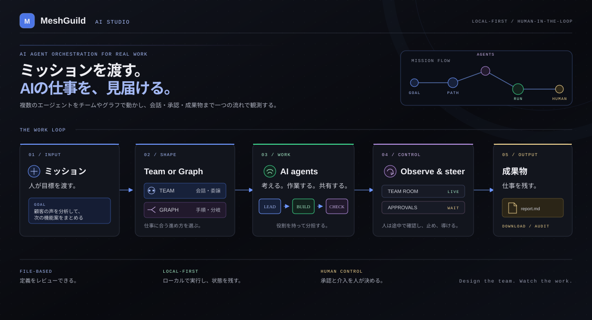
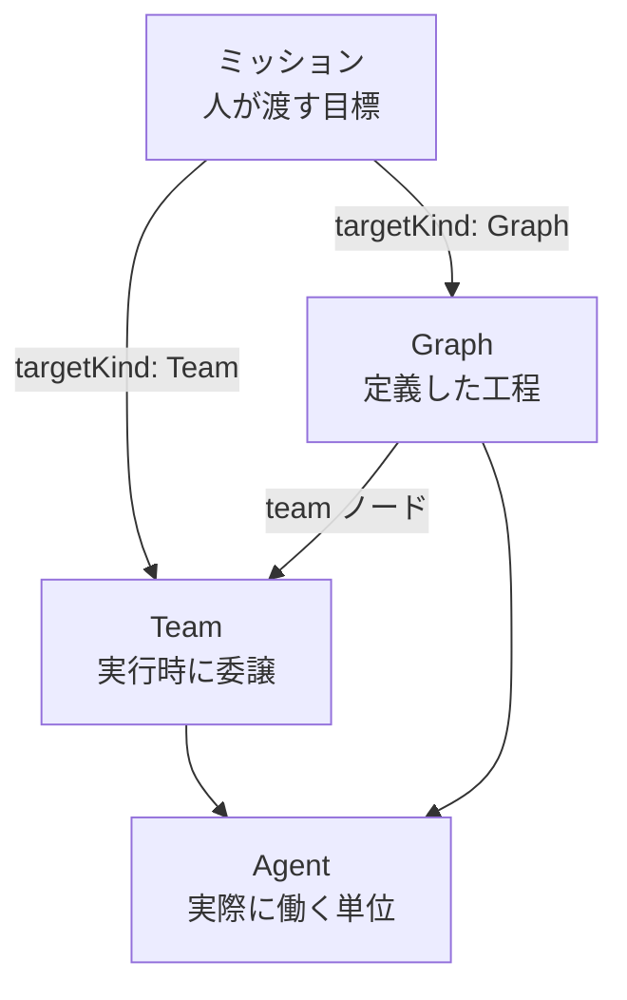
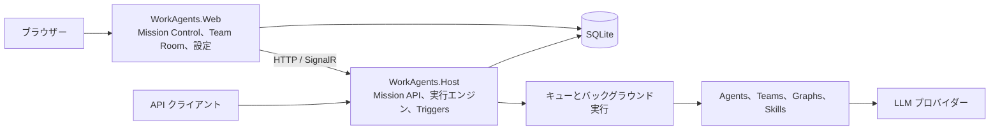

# MeshGuild AI Studio

> 本プロジェクトは現在開発中のアプリケーションです。仕様、画面、動作は予告なく変更される場合があります。

<p align="center">
  <a href="https://dotnet.microsoft.com/download/dotnet/10.0"></a>
  
  
  
  <a href="https://github.com/yt3trees/meshguild-ai-studio/commits/main"></a>
</p>

<p align="center">
  <a href="README.md">English</a> | 日本語
</p>

<p align="center">
  <a href="docs/assets/meshguild-overview-ja.svg">
    
  </a>
</p>

MeshGuild AI Studio は、複数の自律型 AI エージェントへ目標を渡し、会話、委譲、反復、承認を観測する Windows 向けのローカル実行基盤です。
C# と .NET を中心に、エージェント、チーム、グラフ、トリガーをファイルで定義し、ローカルの Web UI と Host から実行します。

AI agent teams for connected workflows.

## 動作イメージ

### Team Room でミッションを観測する

<p align="center">
  
</p>

ミッションの作成、`demo-team` の委譲、Team Room の会話を確認できます。

### Approvals で操作を承認する

<p align="center">
  
</p>

危険なツール呼び出しを承認し、実行を再開するまでの流れを確認できます。

### Graph Studio で工程を編集する

<p align="center">
  
</p>

分岐、並列、ループを含む工程の編集、検証、実行を確認できます。

GIF は `docs/assets/` に置き、元画像は幅 1440px 程度、README では幅 1200px 程度で表示します。

> [!WARNING]
> 現在は Windows 上の Local プロファイルを対象とした開発版です。
> Web と Host の HTTP API に認証はなく、エージェントのツールはローカルユーザーの権限で動作します。
> 信頼できないネットワークや本番環境へ公開しないでください。
> 詳細は [セキュリティと秘密情報](docs/security-and-secrets.md) を参照してください。

## まず読む

- 初めて使う：[利用者向けマニュアル](manual/) と [インストールと起動](manual/_pages/getting-started.md)
- 概念を確認する：[概念を絵で理解する](manual/_pages/concepts.md)
- API から実行する：[API から実行する](manual/_pages/api.md)
- 定義を追加する：[エージェントと定義ファイルの追加](docs/adding-agents.md)
- 設定を変更する：[設定リファレンス](docs/configuration.md)
- 開発時に検証する：[テストガイド](docs/testing.md)
- 文書の全体像を見る：[ドキュメント一覧](docs/README.md)

## できること

- Mission Control と Team Room で、ミッション、エージェント、会話、承認、成果物を観測する
- 実行時の委譲と会話で進める Team と、工程を固定して再現する Graph を使い分ける
- 分岐、並列、合流、ループ、承認を含む工程を Graph Studio で検証する
- Shell やファイル書き込みなどの操作を、人間の承認を挟んで実行する
- 手動、スケジュール、間隔、イベントを起点にミッションを実行する
- SQLite にミッション、会話、グラフ、ループ、トリガー、承認の状態を保存する
- Microsoft Foundry、OpenAI、Amazon Bedrock、OpenRouter、Anthropic、GitHub Models のモデルをエージェントへ割り当てる
- 完了したミッションの会話、評価、コスト、成果物を Replay と Audit で振り返る

## Team と Graph

ミッションは `targetKind: Team` または `targetKind: Graph` で実行対象を指定します。
どちらの場合も、実際に発言し、ツールを呼び出して作業する単位はエージェントです。



| 定義 | 向いている仕事 | 進行を決めるもの |
|---|---|---|
| Agent | 1つの役割に集中させる仕事 | 指示、ツール、権限 |
| Team | 手順を書き切れない探索的な仕事 | 統括エージェントの委譲と会話 |
| Graph | 手順を固定し、同じ工程を再現したい仕事 | ノード、エッジ、条件 |

Graph の `team` ノードを使えば、全体の工程を Graph で固定し、一部の工程だけを Team に任せられます。
定義ファイルの構成と各キーは [エージェントと定義ファイルの追加](docs/adding-agents.md) にまとめています。

## アーキテクチャ

`WorkAgents.Host` が唯一の実行エンジンです。
`WorkAgents.Web` は Host の HTTP API と SignalR を使う観測・操作クライアントで、Web と Host は同じ SQLite を参照します。



ミッション単位の共有ワークスペースは、同じ Team または Graph に参加するエージェントから利用できます。
ワークスペースのファイルと成果物は別に管理されるため、保存先と表示場所の詳細は利用者向けマニュアルを参照してください。

## 必要な環境

- Windows
- [.NET 10 SDK](https://dotnet.microsoft.com/download/dotnet/10.0)
- Git
- 利用する LLM プロバイダーの接続情報
- Microsoft Entra ID 認証を使う場合の [Azure CLI](https://learn.microsoft.com/cli/azure/install-azure-cli-windows)
- Playwright E2E を実行する場合の Node.js と npm

## クイックスタート

### 1. ビルドする

リポジトリのルートで実行します。

```powershell
dotnet restore WorkAgents.sln
dotnet build WorkAgents.sln
```

### 2. ローカル設定を用意する

サンプルを Git 管理対象外の開発用設定へコピーします。

```powershell
Copy-Item src\WorkAgents.Web\appsettings.example.json src\WorkAgents.Web\appsettings.Development.json
Copy-Item src\WorkAgents.Host\appsettings.example.json src\WorkAgents.Host\appsettings.Development.json
```

Web と Host の `Runs:DatabasePath` と `Workspace:Root` は同じ値にしてください。
Host 側の `Orchestration:Engine:Enabled` は `true`、Web 側は `false` のまま使います。
API キー、アクセストークン、秘密鍵は設定ファイルや定義ファイルへ書かず、画面から Local secret store に登録します。
詳しい設定キーは [設定リファレンス](docs/configuration.md) を参照してください。

### 3. Web と Host を起動する

Windows では、リポジトリ直下のランチャーを使えます。

```powershell
.\start-workagents.cmd
```

個別に起動する場合は、別々のターミナルで実行します。

```powershell
dotnet run --project src\WorkAgents.Host\WorkAgents.Host.csproj --launch-profile http
dotnet run --project src\WorkAgents.Web\WorkAgents.Web.csproj --launch-profile http
```

次の URL を開きます。

- Web UI：[http://localhost:5049/](http://localhost:5049/)
- Host：[http://localhost:5160/](http://localhost:5160/)

### 4. モデルを登録してミッションを実行する

1. Web UI の `/models` でモデルを登録し、既定モデルに設定する
2. `/missions/new` で対象種別に `Team`、対象に `demo-team` を選ぶ
3. 目標を入力してミッションを開始する
4. Team Room で委譲、会話、状態、成果物を確認する

画面の各項目と最初のミッションの例は [はじめてのミッション](manual/_pages/first-mission.md) を参照してください。

## API から実行する

長時間のミッション、チーム会話、承認を自動化する場合は Host の API を使います。
ミッションの登録には `POST http://localhost:5160/missions`、単独エージェントの実行には `POST http://localhost:5160/runs` を使います。
リクエスト、状態取得、承認、成果物の取得方法は [API から実行する](manual/_pages/api.md) にまとめています。

Host HTTP API は認証を持たないため、ループバックまたは認証済みの外部境界で保護された環境だけで使ってください。

## 定義を追加する

標準の定義は次の構成で管理します。

```text
src/WorkAgents.Agents/
├── agents/<name>/agent.yaml       # エージェントの役割と権限
├── agents/<name>/instructions.md  # エージェントへの指示
├── teams/<name>/team.yaml         # 動的な委譲と会話
├── graphs/<name>/graph.yaml       # 固定した工程
├── graphs/<name>/scripts/*.csx    # Graph の code ノード
└── skills/<name>/SKILL.md         # 共有スキル
```

Web UI の `New definition` から作成することも、ファイルを直接追加することもできます。
定義形式の正本は `schemas/*.schema.json` です。
定義を変更した後は再ビルドと再起動が必要です。配布版ではトレイメニューの「更新」を使います。

チーム固有の定義ソースやツールプラグインを本体と分離して配布する方法も [エージェントと定義ファイルの追加](docs/adding-agents.md) に記載しています。
新規の工程定義には Graph を使い、旧 `workflow.yaml` は `migrate-workflows` で Graph へ変換してから実行します。

## 開発とテスト

ソリューションのビルドと単体テストを実行します。

```powershell
dotnet build WorkAgents.sln
dotnet test tests/WorkAgents.UnitTests/WorkAgents.UnitTests.csproj
```

Playwright E2E の初回セットアップと実行は次のとおりです。

```powershell
npm ci
npm run test:e2e:install
npm run typecheck
npm run test:e2e
```

E2E は WebServer を自動起動するため、先に `dotnet run` で開発サーバーを起動しないでください。
変更箇所に応じた単体テスト、E2E、トレイの手動確認は [テストガイド](docs/testing.md) を参照してください。

## 主なプロジェクト

| パス | 役割 |
|---|---|
| `src/WorkAgents.Core` | Mission、Team、Graph、Loop、Trigger、承認のドメインモデルと抽象 |
| `src/WorkAgents.Orchestration` | Mission の実行、Team、Graph、Loop、Checkpoint、Replay、Trigger |
| `src/WorkAgents.Agents` | 定義のロード、エージェント、チーム、グラフ、スキル、ツール |
| `src/WorkAgents.Harness` | ファイル、Shell、作業ディレクトリ拘束、Git 認証、承認連携 |
| `src/WorkAgents.Infrastructure` | SQLite、キュー、秘密情報、テレメトリ |
| `src/WorkAgents.Host` | Mission API、非同期実行、Triggers、SignalR |
| `src/WorkAgents.Web` | Blazor UI、Mission Control、Team Room、Graph Studio、Approvals、設定 |
| `src/WorkAgents.Tray` | Host と Web を起動する常駐トレイランチャー |
| `tests/WorkAgents.UnitTests` | xUnit 単体テスト |

## 文書

- [ドキュメント一覧](docs/README.md)：文書の用途と現行の実行経路
- [利用者向けマニュアル](manual/)：インストール、ミッション、定義編集、設定、FAQ
- [設定リファレンス](docs/configuration.md)：Host と Web の設定、モデルプロバイダー
- [エージェントと定義ファイルの追加](docs/adding-agents.md)：Agent、Team、Graph、外部定義ソース、ツール
- [セキュリティと秘密情報](docs/security-and-secrets.md)：Local 実行、承認、秘密情報の保存
- [テストガイド](docs/testing.md)：単体テスト、E2E、MCP、ストリーミング、トレイの確認
- [マニュアルサイトの開発](docs/manual-site-development.md)：`manual/` の Jekyll サイト
- [機能仕様](specs/)：機能単位の仕様、契約、データモデル、検証手順
- [設計判断](docs/decisions/)：LLM プロバイダーとホスティングに関する ADR
