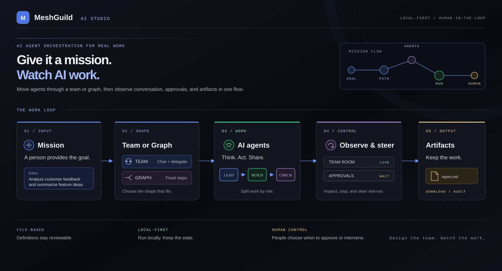
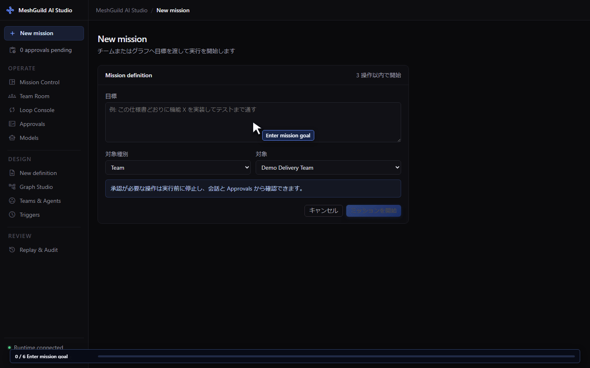
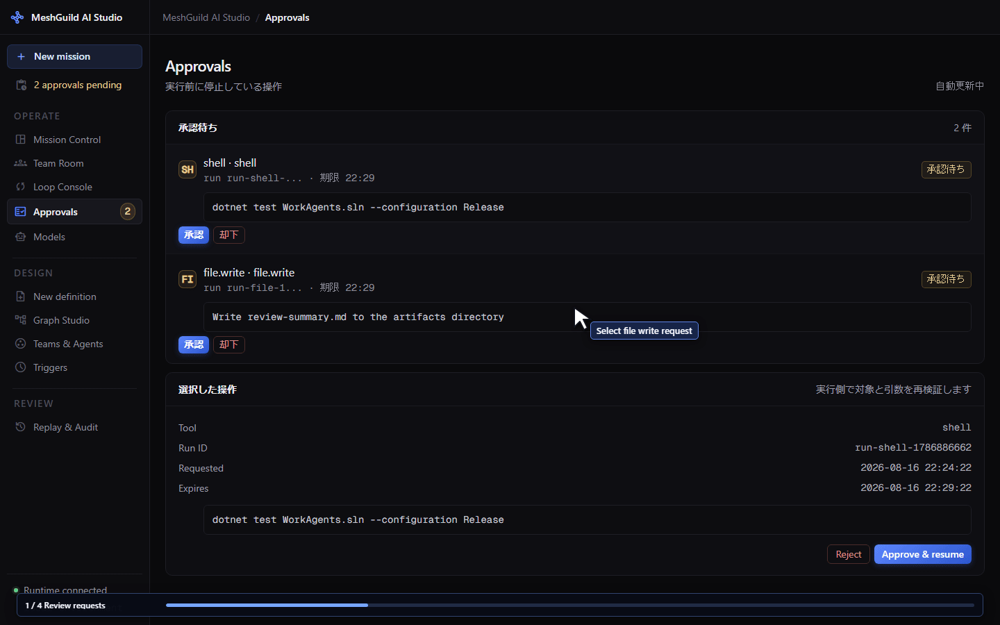
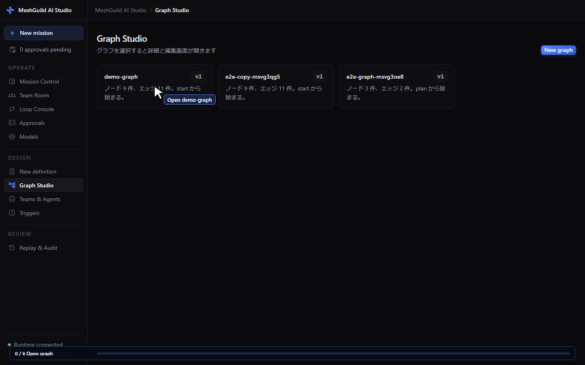
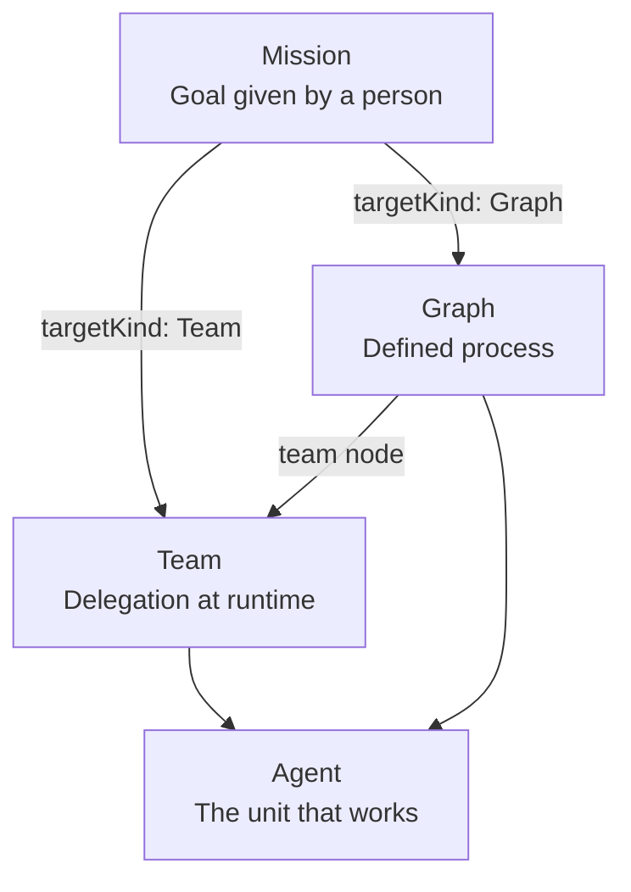
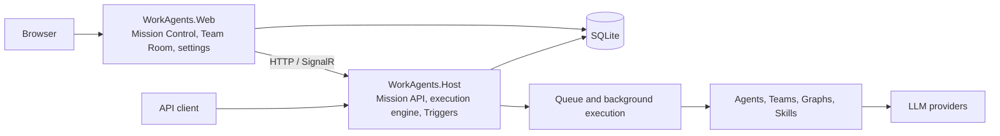

# MeshGuild AI Studio

> This application is currently under development. Its specifications, UI, and behavior may change without notice.

<p align="center">
  <a href="https://dotnet.microsoft.com/download/dotnet/10.0"></a>
  
  
  
  <a href="https://github.com/yt3trees/meshguild-ai-studio/commits/main"></a>
</p>

<p align="center">
  English | <a href="README-ja.md">日本語</a>
</p>

<p align="center">
  <a href="docs/assets/meshguild-overview-en.svg">
    
  </a>
</p>

MeshGuild AI Studio is a local-first runtime for Windows that hands a goal to multiple autonomous AI agents, then lets you observe their conversation, delegation, iteration, and approvals.
Built around C# and .NET, it defines agents, teams, graphs, and triggers as files, and runs them from a local Web UI and Host.

AI agent teams for connected workflows.

## How it looks

### Observe a mission in the Team Room

<p align="center">
  
</p>

Creating a mission, delegation across `demo-team`, and the conversation in the Team Room.

### Approve an operation in Approvals

<p align="center">
  
</p>

Approving a risky tool call and resuming the run.

### Edit a process in Graph Studio

<p align="center">
  
</p>

Editing, validating, and running a process that contains branches, parallel paths, and loops.

GIFs live in `docs/assets/`; source captures are around 1440px wide and are displayed at about 1200px in the README.

> [!WARNING]
> This is a development build targeting the Local profile on Windows.
> The Web and Host HTTP APIs have no authentication, and agent tools run with the local user's privileges.
> Do not expose it to untrusted networks or production environments.
> See [Security and secrets](docs/security-and-secrets.md) for details.

## Start here

- New to the project: [User manual](manual/) and [Install and start](manual/_pages/getting-started.md)
- Learn the concepts: [Concepts in pictures](manual/_pages/concepts.md)
- Run from the API: [Run from the API](manual/_pages/api.md)
- Add definitions: [Adding agents and definition files](docs/adding-agents.md)
- Change settings: [Configuration reference](docs/configuration.md)
- Verify during development: [Testing guide](docs/testing.md)
- See all documents: [Documentation index](docs/README.md)

## What you can do

- Observe missions, agents, conversations, approvals, and artifacts in Mission Control and the Team Room
- Choose between a Team that progresses through runtime delegation and conversation, and a Graph that fixes and reproduces a process
- Validate processes with branches, parallel paths, joins, loops, and approvals in Graph Studio
- Run operations such as Shell commands and file writes behind a human approval step
- Start missions manually or from schedules, intervals, and events
- Persist mission, conversation, graph, loop, trigger, and approval state in SQLite
- Assign models from Microsoft Foundry, OpenAI, Amazon Bedrock, OpenRouter, Anthropic, and GitHub Models to agents
- Review conversations, evaluations, costs, and artifacts of finished missions with Replay and Audit

## Team and Graph

A mission specifies its execution target with `targetKind: Team` or `targetKind: Graph`.
In both cases, the unit that actually speaks and calls tools to do the work is the agent.



| Definition | Best suited for | What drives progress |
|---|---|---|
| Agent | Work focused on a single role | Instructions, tools, permissions |
| Team | Exploratory work whose steps cannot be written out in advance | Delegation and conversation by the lead agent |
| Graph | Work whose steps are fixed and must be reproduced | Nodes, edges, conditions |

With a Graph `team` node, you can fix the overall process as a Graph and hand only part of it to a Team.
Definition file structure and each key are covered in [Adding agents and definition files](docs/adding-agents.md).

## Architecture

`WorkAgents.Host` is the only execution engine.
`WorkAgents.Web` is an observation and operation client that uses the Host's HTTP API and SignalR; Web and Host reference the same SQLite database.



A per-mission shared workspace is available to every agent participating in the same Team or Graph.
Workspace files and artifacts are managed separately, so see the user manual for where each is stored and displayed.

## Requirements

- Windows
- [.NET 10 SDK](https://dotnet.microsoft.com/download/dotnet/10.0)
- Git
- Connection details for the LLM providers you use
- [Azure CLI](https://learn.microsoft.com/cli/azure/install-azure-cli-windows) if you use Microsoft Entra ID authentication
- Node.js and npm if you run the Playwright E2E suite

## Quick start

### 1. Build

Run at the repository root.

```powershell
dotnet restore WorkAgents.sln
dotnet build WorkAgents.sln
```

### 2. Prepare local settings

Copy the samples into development settings that are excluded from Git.

```powershell
Copy-Item src\WorkAgents.Web\appsettings.example.json src\WorkAgents.Web\appsettings.Development.json
Copy-Item src\WorkAgents.Host\appsettings.example.json src\WorkAgents.Host\appsettings.Development.json
```

Use the same values for `Runs:DatabasePath` and `Workspace:Root` in both Web and Host.
Set `Orchestration:Engine:Enabled` to `true` on the Host side, and leave it `false` on the Web side.
Do not write API keys, access tokens, or private keys into settings or definition files; register them in the Local secret store from the UI.
See [Configuration reference](docs/configuration.md) for the full list of keys.

### 3. Start Web and Host

On Windows, you can use the launcher at the repository root.

```powershell
.\start-workagents.cmd
```

To start them individually, run each in its own terminal.

```powershell
dotnet run --project src\WorkAgents.Host\WorkAgents.Host.csproj --launch-profile http
dotnet run --project src\WorkAgents.Web\WorkAgents.Web.csproj --launch-profile http
```

Then open:

- Web UI: [http://localhost:5049/](http://localhost:5049/)
- Host: [http://localhost:5160/](http://localhost:5160/)

### 4. Register a model and run a mission

1. Register a model at `/models` in the Web UI and set it as the default model
2. At `/missions/new`, choose `Team` as the target kind and `demo-team` as the target
3. Enter a goal and start the mission
4. Watch delegation, conversation, state, and artifacts in the Team Room

For each field on screen and an example first mission, see [Your first mission](manual/_pages/first-mission.md).

## Run from the API

Use the Host API to automate long-running missions, team conversations, and approvals.
Register a mission with `POST http://localhost:5160/missions`, and run a single agent with `POST http://localhost:5160/runs`.
Requests, status retrieval, approvals, and artifact retrieval are covered in [Run from the API](manual/_pages/api.md).

The Host HTTP API has no authentication, so use it only on loopback or inside an environment protected by an authenticated external boundary.

## Add definitions

Standard definitions are managed in the following structure.

```text
src/WorkAgents.Agents/
├── agents/<name>/agent.yaml       # Agent role and permissions
├── agents/<name>/instructions.md  # Instructions for the agent
├── teams/<name>/team.yaml         # Dynamic delegation and conversation
├── graphs/<name>/graph.yaml       # Fixed process
├── graphs/<name>/scripts/*.csx    # Graph code nodes
└── skills/<name>/SKILL.md         # Shared skills
```

You can create them from `New definition` in the Web UI, or add files directly.
The source of truth for definition formats is `schemas/*.schema.json`.
After changing a definition, rebuild and restart. In packaged builds, use "Update" from the tray menu.

[Adding agents and definition files](docs/adding-agents.md) also describes how to ship team-specific definition sources and tool plugins separately from the core.
Use Graph for new process definitions; convert legacy `workflow.yaml` files with `migrate-workflows` before running them.

## Development and testing

Build the solution and run unit tests.

```powershell
dotnet build WorkAgents.sln
dotnet test tests/WorkAgents.UnitTests/WorkAgents.UnitTests.csproj
```

First-time setup and execution of the Playwright E2E suite:

```powershell
npm ci
npm run test:e2e:install
npm run typecheck
npm run test:e2e
```

E2E starts the WebServer itself, so do not start the development servers with `dotnet run` beforehand.
See the [Testing guide](docs/testing.md) for which unit tests, E2E runs, and manual tray checks match each kind of change.

## Main projects

| Path | Role |
|---|---|
| `src/WorkAgents.Core` | Domain models and abstractions for Mission, Team, Graph, Loop, Trigger, approvals |
| `src/WorkAgents.Orchestration` | Mission execution, Team, Graph, Loop, Checkpoint, Replay, Trigger |
| `src/WorkAgents.Agents` | Definition loading, agents, teams, graphs, skills, tools |
| `src/WorkAgents.Harness` | Files, Shell, working directory confinement, Git authentication, approval integration |
| `src/WorkAgents.Infrastructure` | SQLite, queue, secrets, telemetry |
| `src/WorkAgents.Host` | Mission API, asynchronous execution, Triggers, SignalR |
| `src/WorkAgents.Web` | Blazor UI, Mission Control, Team Room, Graph Studio, Approvals, settings |
| `src/WorkAgents.Tray` | Resident tray launcher that starts Host and Web |
| `tests/WorkAgents.UnitTests` | xUnit unit tests |

## Documentation

- [Documentation index](docs/README.md): what each document is for and the current execution paths
- [User manual](manual/): install, missions, editing definitions, settings, FAQ
- [Configuration reference](docs/configuration.md): Host and Web settings, model providers
- [Adding agents and definition files](docs/adding-agents.md): Agent, Team, Graph, external definition sources, tools
- [Security and secrets](docs/security-and-secrets.md): Local execution, approvals, storing secrets
- [Testing guide](docs/testing.md): unit tests, E2E, MCP, streaming, tray checks
- [Manual site development](docs/manual-site-development.md): the Jekyll site under `manual/`
- [Feature specifications](specs/): per-feature specs, contracts, data models, verification steps
- [Design decisions](docs/decisions/): ADRs on LLM providers and hosting
