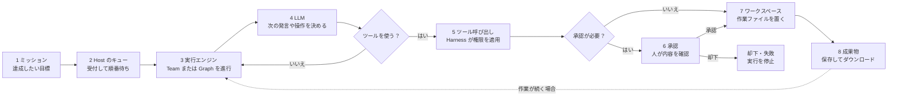

最初に覚える用語を、1つの実行の流れに沿って配置します。
ミッションを受け取った Host がキューへ積み、実行エンジンが LLM とツールを組み合わせて作業し、必要な場面で人間の承認を待って成果物を保存します。

## ミッションから成果物まで

図の「作業が続く場合」は、成果物を保存したら必ず終了するという意味ではありません。
チームは会話や委譲を続けることがあり、グラフは次のノードへ進みます。
最終的に残すファイルが成果物として登録されると、Team Room からダウンロードできます。

## それぞれの箱が指すもの

1. ミッション：達成したい目標と、実行対象のチームまたはグラフをまとめた依頼です。
2. Host のキュー：Web 画面や API から届いた依頼を受け付け、バックグラウンド実行へ渡します。
3. 実行エンジン：チームの委譲やグラフのノード遷移を進め、Run と状態を記録します。
4. LLM：エージェントの指示と現在の入力を読み、次の発言やツール呼び出しを生成します。
5. ツール呼び出し：ファイル操作や Shell などを、エージェントに与えた harness の権限で実行します。
6. 承認：危険度の高い操作やグラフの承認ノードで停止し、人間が Approvals 画面から決定します。
7. ワークスペース：clone、編集、テストなど、実行中に使う作業場所です。
8. 成果物：実行後も残すファイルとメタデータです。ワークスペースのファイルが自動で成果物になるわけではありません。

## Team と Graph の違い

同じミッションでも、作業の決め方が異なります。

- Team：オーケストレーターが状況を見てメンバーへ委譲するため、手順が実行中に変わります。
- Graph：ノード、条件、並列、ループ、承認の位置を定義しておくため、同じ工程を再現しやすくなります。

詳しい選択基準は[概要]({{ '/pages/features/' | relative_url }})の「どれを使うか」、ファイルの実体は[ファイルと成果物]({{ '/pages/storage/' | relative_url }})を参照してください。
